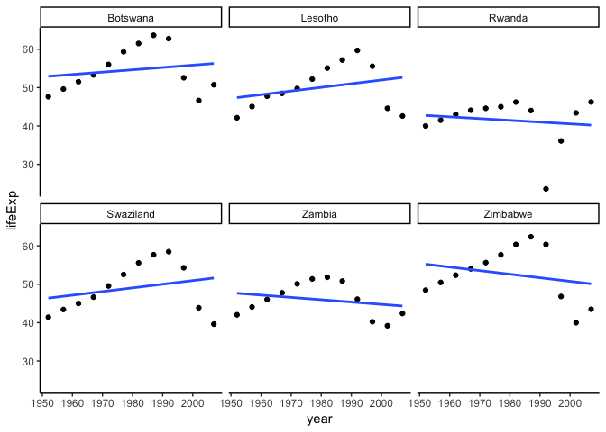

STAT547\_hw06
================

``` r
library(tidyverse)
```

    ## ── Attaching packages ───────────────────────────────────────────────── tidyverse 1.2.1 ──

    ## ✔ ggplot2 3.0.0     ✔ purrr   0.2.5
    ## ✔ tibble  1.4.2     ✔ dplyr   0.7.6
    ## ✔ tidyr   0.8.1     ✔ stringr 1.3.1
    ## ✔ readr   1.1.1     ✔ forcats 0.3.0

    ## ── Conflicts ──────────────────────────────────────────────────── tidyverse_conflicts() ──
    ## ✖ dplyr::filter() masks stats::filter()
    ## ✖ dplyr::lag()    masks stats::lag()

``` r
library(testthat)
```

    ## 
    ## Attaching package: 'testthat'

    ## The following object is masked from 'package:dplyr':
    ## 
    ##     matches

    ## The following object is masked from 'package:purrr':
    ## 
    ##     is_null

``` r
library(gapminder)
library(broom)
```

# (1) Character data

For this prompt, I have selected some exercises from Hadley Wickham’s [R
for Data
Science](https://r4ds.had.co.nz/strings.html#other-types-of-pattern). I
will subdivide this into three sections. (A) Miscellaneous exercises and
(B) *Regular expressions* exercises, both from **R for Data Science**,
and (C) A practical application of
regex.

## (1-A) Miscellaneous

``` r
#Describe the difference between the sep and collapse arguments to str_c().

str_c("a fox", "is not a bear", sep = ": ") #sep is useful with two independent strings
```

    ## [1] "a fox: is not a bear"

``` r
str_c(c("a fox", "is not a bear"), sep = ": ") #sep not so useful with a vector of strings
```

    ## [1] "a fox"         "is not a bear"

``` r
str_c(c("a fox", "is not a bear"), collapse = ": ") #collapse puts a vector of strings into one string, and separates by the specified argument
```

    ## [1] "a fox: is not a bear"

``` r
#What does str_wrap() do? When might you want to use it?

s <- str_c(sentences[[1]], sentences[[2]], sentences[[3]], sep = " ") #Random paragraph

#str_wrap formats the text wrapping of the output
str_wrap(s, width = 30, indent = 5, exdent = 3) %>% writeLines()
```

    ##      The birch canoe slid on the
    ##    smooth planks. Glue the sheet
    ##    to the dark blue background.
    ##    It's easy to tell the depth of
    ##    a well.

``` r
#What does str_trim() do? What’s the opposite of str_trim()?

str_trim("   Here is a poorly formatted sentence. It has a lot of white space.    ", side = "both")
```

    ## [1] "Here is a poorly formatted sentence. It has a lot of white space."

``` r
#str_trim removes white space from a string, including tab and new lines.

str_pad("Here is a sentence to which I want to add white space.", width = 100)
```

    ## [1] "                                              Here is a sentence to which I want to add white space."

``` r
#str_pad adds white space (or a specified string) until the width reaches the specified argument.
#I use 100 because it is longer than the sentence's character count
```

## (1-B) Regular Expressions

``` r
#How would you match the sequence "'\?
x <- "\"\'\\"
str_view(x, "\"\'\\\\")
```

<!--html_preserve-->

<div id="htmlwidget-89e83260597ed28e14a5" class="str_view html-widget" style="width:960px;height:100%;">

</div>

<script type="application/json" data-for="htmlwidget-89e83260597ed28e14a5">{"x":{"html":"<ul>\n  <li><span class='match'>\"'\\<\/span><\/li>\n<\/ul>"},"evals":[],"jsHooks":[]}</script>

<!--/html_preserve-->

``` r
#What patterns will the regular expression \\..\\..\\.. match? How would you represent it as a string?

x1 <- c("abc123", ".a.b.c", "......", ".\\.\\.\\")
str_view_all(x1, pattern = "\\..\\..\\..")
```

<!--html_preserve-->

<div id="htmlwidget-e8bebb792d24c2e8816d" class="str_view html-widget" style="width:960px;height:100%;">

</div>

<script type="application/json" data-for="htmlwidget-e8bebb792d24c2e8816d">{"x":{"html":"<ul>\n  <li>abc123<\/li>\n  <li><span class='match'>.a.b.c<\/span><\/li>\n  <li><span class='match'>......<\/span><\/li>\n  <li><span class='match'>.\\.\\.\\<\/span><\/li>\n<\/ul>"},"evals":[],"jsHooks":[]}</script>

<!--/html_preserve-->

``` r
#"\\.." as a regex finds a literal dot, then anything. Repeat thrice.
```

``` r
#How would you match the literal string "$^$"?

str_view("$^$", pattern = "\\$\\^\\$")
```

<!--html_preserve-->

<div id="htmlwidget-bd8839ef61be868df4c2" class="str_view html-widget" style="width:960px;height:100%;">

</div>

<script type="application/json" data-for="htmlwidget-bd8839ef61be868df4c2">{"x":{"html":"<ul>\n  <li><span class='match'>$^$<\/span><\/li>\n<\/ul>"},"evals":[],"jsHooks":[]}</script>

<!--/html_preserve-->

``` r
#similar to finding a literal dot, need two backslashes
```

``` r
#Given the corpus of common words in stringr::words, create regular expressions that find all words that:

#Start with “y”.
str_view(words, "^y", match = TRUE)
```

<!--html_preserve-->

<div id="htmlwidget-28682bf0f0ca86abb496" class="str_view html-widget" style="width:960px;height:100%;">

</div>

<script type="application/json" data-for="htmlwidget-28682bf0f0ca86abb496">{"x":{"html":"<ul>\n  <li><span class='match'>y<\/span>ear<\/li>\n  <li><span class='match'>y<\/span>es<\/li>\n  <li><span class='match'>y<\/span>esterday<\/li>\n  <li><span class='match'>y<\/span>et<\/li>\n  <li><span class='match'>y<\/span>ou<\/li>\n  <li><span class='match'>y<\/span>oung<\/li>\n<\/ul>"},"evals":[],"jsHooks":[]}</script>

<!--/html_preserve-->

``` r
#End with “x”
str_view(words, "x$", match = TRUE)
```

<!--html_preserve-->

<div id="htmlwidget-73d34faa7459eca81cbd" class="str_view html-widget" style="width:960px;height:100%;">

</div>

<script type="application/json" data-for="htmlwidget-73d34faa7459eca81cbd">{"x":{"html":"<ul>\n  <li>bo<span class='match'>x<\/span><\/li>\n  <li>se<span class='match'>x<\/span><\/li>\n  <li>si<span class='match'>x<\/span><\/li>\n  <li>ta<span class='match'>x<\/span><\/li>\n<\/ul>"},"evals":[],"jsHooks":[]}</script>

<!--/html_preserve-->

``` r
#Are exactly three letters long.
str_view(words, "^...$", match = TRUE)
```

<!--html_preserve-->

<div id="htmlwidget-fd6d7023717e2fce0cd5" class="str_view html-widget" style="width:960px;height:100%;">

</div>

<script type="application/json" data-for="htmlwidget-fd6d7023717e2fce0cd5">{"x":{"html":"<ul>\n  <li><span class='match'>act<\/span><\/li>\n  <li><span class='match'>add<\/span><\/li>\n  <li><span class='match'>age<\/span><\/li>\n  <li><span class='match'>ago<\/span><\/li>\n  <li><span class='match'>air<\/span><\/li>\n  <li><span class='match'>all<\/span><\/li>\n  <li><span class='match'>and<\/span><\/li>\n  <li><span class='match'>any<\/span><\/li>\n  <li><span class='match'>arm<\/span><\/li>\n  <li><span class='match'>art<\/span><\/li>\n  <li><span class='match'>ask<\/span><\/li>\n  <li><span class='match'>bad<\/span><\/li>\n  <li><span class='match'>bag<\/span><\/li>\n  <li><span class='match'>bar<\/span><\/li>\n  <li><span class='match'>bed<\/span><\/li>\n  <li><span class='match'>bet<\/span><\/li>\n  <li><span class='match'>big<\/span><\/li>\n  <li><span class='match'>bit<\/span><\/li>\n  <li><span class='match'>box<\/span><\/li>\n  <li><span class='match'>boy<\/span><\/li>\n  <li><span class='match'>bus<\/span><\/li>\n  <li><span class='match'>but<\/span><\/li>\n  <li><span class='match'>buy<\/span><\/li>\n  <li><span class='match'>can<\/span><\/li>\n  <li><span class='match'>car<\/span><\/li>\n  <li><span class='match'>cat<\/span><\/li>\n  <li><span class='match'>cup<\/span><\/li>\n  <li><span class='match'>cut<\/span><\/li>\n  <li><span class='match'>dad<\/span><\/li>\n  <li><span class='match'>day<\/span><\/li>\n  <li><span class='match'>die<\/span><\/li>\n  <li><span class='match'>dog<\/span><\/li>\n  <li><span class='match'>dry<\/span><\/li>\n  <li><span class='match'>due<\/span><\/li>\n  <li><span class='match'>eat<\/span><\/li>\n  <li><span class='match'>egg<\/span><\/li>\n  <li><span class='match'>end<\/span><\/li>\n  <li><span class='match'>eye<\/span><\/li>\n  <li><span class='match'>far<\/span><\/li>\n  <li><span class='match'>few<\/span><\/li>\n  <li><span class='match'>fit<\/span><\/li>\n  <li><span class='match'>fly<\/span><\/li>\n  <li><span class='match'>for<\/span><\/li>\n  <li><span class='match'>fun<\/span><\/li>\n  <li><span class='match'>gas<\/span><\/li>\n  <li><span class='match'>get<\/span><\/li>\n  <li><span class='match'>god<\/span><\/li>\n  <li><span class='match'>guy<\/span><\/li>\n  <li><span class='match'>hit<\/span><\/li>\n  <li><span class='match'>hot<\/span><\/li>\n  <li><span class='match'>how<\/span><\/li>\n  <li><span class='match'>job<\/span><\/li>\n  <li><span class='match'>key<\/span><\/li>\n  <li><span class='match'>kid<\/span><\/li>\n  <li><span class='match'>lad<\/span><\/li>\n  <li><span class='match'>law<\/span><\/li>\n  <li><span class='match'>lay<\/span><\/li>\n  <li><span class='match'>leg<\/span><\/li>\n  <li><span class='match'>let<\/span><\/li>\n  <li><span class='match'>lie<\/span><\/li>\n  <li><span class='match'>lot<\/span><\/li>\n  <li><span class='match'>low<\/span><\/li>\n  <li><span class='match'>man<\/span><\/li>\n  <li><span class='match'>may<\/span><\/li>\n  <li><span class='match'>mrs<\/span><\/li>\n  <li><span class='match'>new<\/span><\/li>\n  <li><span class='match'>non<\/span><\/li>\n  <li><span class='match'>not<\/span><\/li>\n  <li><span class='match'>now<\/span><\/li>\n  <li><span class='match'>odd<\/span><\/li>\n  <li><span class='match'>off<\/span><\/li>\n  <li><span class='match'>old<\/span><\/li>\n  <li><span class='match'>one<\/span><\/li>\n  <li><span class='match'>out<\/span><\/li>\n  <li><span class='match'>own<\/span><\/li>\n  <li><span class='match'>pay<\/span><\/li>\n  <li><span class='match'>per<\/span><\/li>\n  <li><span class='match'>put<\/span><\/li>\n  <li><span class='match'>red<\/span><\/li>\n  <li><span class='match'>rid<\/span><\/li>\n  <li><span class='match'>run<\/span><\/li>\n  <li><span class='match'>say<\/span><\/li>\n  <li><span class='match'>see<\/span><\/li>\n  <li><span class='match'>set<\/span><\/li>\n  <li><span class='match'>sex<\/span><\/li>\n  <li><span class='match'>she<\/span><\/li>\n  <li><span class='match'>sir<\/span><\/li>\n  <li><span class='match'>sit<\/span><\/li>\n  <li><span class='match'>six<\/span><\/li>\n  <li><span class='match'>son<\/span><\/li>\n  <li><span class='match'>sun<\/span><\/li>\n  <li><span class='match'>tax<\/span><\/li>\n  <li><span class='match'>tea<\/span><\/li>\n  <li><span class='match'>ten<\/span><\/li>\n  <li><span class='match'>the<\/span><\/li>\n  <li><span class='match'>tie<\/span><\/li>\n  <li><span class='match'>too<\/span><\/li>\n  <li><span class='match'>top<\/span><\/li>\n  <li><span class='match'>try<\/span><\/li>\n  <li><span class='match'>two<\/span><\/li>\n  <li><span class='match'>use<\/span><\/li>\n  <li><span class='match'>war<\/span><\/li>\n  <li><span class='match'>way<\/span><\/li>\n  <li><span class='match'>wee<\/span><\/li>\n  <li><span class='match'>who<\/span><\/li>\n  <li><span class='match'>why<\/span><\/li>\n  <li><span class='match'>win<\/span><\/li>\n  <li><span class='match'>yes<\/span><\/li>\n  <li><span class='match'>yet<\/span><\/li>\n  <li><span class='match'>you<\/span><\/li>\n<\/ul>"},"evals":[],"jsHooks":[]}</script>

<!--/html_preserve-->

``` r
#Have seven letters or more.
str_view(words, "^.......", match = TRUE)
```

<!--html_preserve-->

<div id="htmlwidget-6275594cd9df5fd9dba7" class="str_view html-widget" style="width:960px;height:100%;">

</div>

<script type="application/json" data-for="htmlwidget-6275594cd9df5fd9dba7">{"x":{"html":"<ul>\n  <li><span class='match'>absolut<\/span>e<\/li>\n  <li><span class='match'>account<\/span><\/li>\n  <li><span class='match'>achieve<\/span><\/li>\n  <li><span class='match'>address<\/span><\/li>\n  <li><span class='match'>adverti<\/span>se<\/li>\n  <li><span class='match'>afterno<\/span>on<\/li>\n  <li><span class='match'>against<\/span><\/li>\n  <li><span class='match'>already<\/span><\/li>\n  <li><span class='match'>alright<\/span><\/li>\n  <li><span class='match'>althoug<\/span>h<\/li>\n  <li><span class='match'>america<\/span><\/li>\n  <li><span class='match'>another<\/span><\/li>\n  <li><span class='match'>apparen<\/span>t<\/li>\n  <li><span class='match'>appoint<\/span><\/li>\n  <li><span class='match'>approac<\/span>h<\/li>\n  <li><span class='match'>appropr<\/span>iate<\/li>\n  <li><span class='match'>arrange<\/span><\/li>\n  <li><span class='match'>associa<\/span>te<\/li>\n  <li><span class='match'>authori<\/span>ty<\/li>\n  <li><span class='match'>availab<\/span>le<\/li>\n  <li><span class='match'>balance<\/span><\/li>\n  <li><span class='match'>because<\/span><\/li>\n  <li><span class='match'>believe<\/span><\/li>\n  <li><span class='match'>benefit<\/span><\/li>\n  <li><span class='match'>between<\/span><\/li>\n  <li><span class='match'>brillia<\/span>nt<\/li>\n  <li><span class='match'>britain<\/span><\/li>\n  <li><span class='match'>brother<\/span><\/li>\n  <li><span class='match'>busines<\/span>s<\/li>\n  <li><span class='match'>certain<\/span><\/li>\n  <li><span class='match'>chairma<\/span>n<\/li>\n  <li><span class='match'>charact<\/span>er<\/li>\n  <li><span class='match'>Christm<\/span>as<\/li>\n  <li><span class='match'>colleag<\/span>ue<\/li>\n  <li><span class='match'>collect<\/span><\/li>\n  <li><span class='match'>college<\/span><\/li>\n  <li><span class='match'>comment<\/span><\/li>\n  <li><span class='match'>committ<\/span>ee<\/li>\n  <li><span class='match'>communi<\/span>ty<\/li>\n  <li><span class='match'>company<\/span><\/li>\n  <li><span class='match'>compare<\/span><\/li>\n  <li><span class='match'>complet<\/span>e<\/li>\n  <li><span class='match'>compute<\/span><\/li>\n  <li><span class='match'>concern<\/span><\/li>\n  <li><span class='match'>conditi<\/span>on<\/li>\n  <li><span class='match'>conside<\/span>r<\/li>\n  <li><span class='match'>consult<\/span><\/li>\n  <li><span class='match'>contact<\/span><\/li>\n  <li><span class='match'>continu<\/span>e<\/li>\n  <li><span class='match'>contrac<\/span>t<\/li>\n  <li><span class='match'>control<\/span><\/li>\n  <li><span class='match'>convers<\/span>e<\/li>\n  <li><span class='match'>correct<\/span><\/li>\n  <li><span class='match'>council<\/span><\/li>\n  <li><span class='match'>country<\/span><\/li>\n  <li><span class='match'>current<\/span><\/li>\n  <li><span class='match'>decisio<\/span>n<\/li>\n  <li><span class='match'>definit<\/span>e<\/li>\n  <li><span class='match'>departm<\/span>ent<\/li>\n  <li><span class='match'>describ<\/span>e<\/li>\n  <li><span class='match'>develop<\/span><\/li>\n  <li><span class='match'>differe<\/span>nce<\/li>\n  <li><span class='match'>difficu<\/span>lt<\/li>\n  <li><span class='match'>discuss<\/span><\/li>\n  <li><span class='match'>distric<\/span>t<\/li>\n  <li><span class='match'>documen<\/span>t<\/li>\n  <li><span class='match'>economy<\/span><\/li>\n  <li><span class='match'>educate<\/span><\/li>\n  <li><span class='match'>electri<\/span>c<\/li>\n  <li><span class='match'>encoura<\/span>ge<\/li>\n  <li><span class='match'>english<\/span><\/li>\n  <li><span class='match'>environ<\/span>ment<\/li>\n  <li><span class='match'>especia<\/span>l<\/li>\n  <li><span class='match'>evening<\/span><\/li>\n  <li><span class='match'>evidenc<\/span>e<\/li>\n  <li><span class='match'>example<\/span><\/li>\n  <li><span class='match'>exercis<\/span>e<\/li>\n  <li><span class='match'>expense<\/span><\/li>\n  <li><span class='match'>experie<\/span>nce<\/li>\n  <li><span class='match'>explain<\/span><\/li>\n  <li><span class='match'>express<\/span><\/li>\n  <li><span class='match'>finance<\/span><\/li>\n  <li><span class='match'>fortune<\/span><\/li>\n  <li><span class='match'>forward<\/span><\/li>\n  <li><span class='match'>functio<\/span>n<\/li>\n  <li><span class='match'>further<\/span><\/li>\n  <li><span class='match'>general<\/span><\/li>\n  <li><span class='match'>germany<\/span><\/li>\n  <li><span class='match'>goodbye<\/span><\/li>\n  <li><span class='match'>history<\/span><\/li>\n  <li><span class='match'>holiday<\/span><\/li>\n  <li><span class='match'>hospita<\/span>l<\/li>\n  <li><span class='match'>however<\/span><\/li>\n  <li><span class='match'>hundred<\/span><\/li>\n  <li><span class='match'>husband<\/span><\/li>\n  <li><span class='match'>identif<\/span>y<\/li>\n  <li><span class='match'>imagine<\/span><\/li>\n  <li><span class='match'>importa<\/span>nt<\/li>\n  <li><span class='match'>improve<\/span><\/li>\n  <li><span class='match'>include<\/span><\/li>\n  <li><span class='match'>increas<\/span>e<\/li>\n  <li><span class='match'>individ<\/span>ual<\/li>\n  <li><span class='match'>industr<\/span>y<\/li>\n  <li><span class='match'>instead<\/span><\/li>\n  <li><span class='match'>interes<\/span>t<\/li>\n  <li><span class='match'>introdu<\/span>ce<\/li>\n  <li><span class='match'>involve<\/span><\/li>\n  <li><span class='match'>kitchen<\/span><\/li>\n  <li><span class='match'>languag<\/span>e<\/li>\n  <li><span class='match'>machine<\/span><\/li>\n  <li><span class='match'>meaning<\/span><\/li>\n  <li><span class='match'>measure<\/span><\/li>\n  <li><span class='match'>mention<\/span><\/li>\n  <li><span class='match'>million<\/span><\/li>\n  <li><span class='match'>ministe<\/span>r<\/li>\n  <li><span class='match'>morning<\/span><\/li>\n  <li><span class='match'>necessa<\/span>ry<\/li>\n  <li><span class='match'>obvious<\/span><\/li>\n  <li><span class='match'>occasio<\/span>n<\/li>\n  <li><span class='match'>operate<\/span><\/li>\n  <li><span class='match'>opportu<\/span>nity<\/li>\n  <li><span class='match'>organiz<\/span>e<\/li>\n  <li><span class='match'>origina<\/span>l<\/li>\n  <li><span class='match'>otherwi<\/span>se<\/li>\n  <li><span class='match'>paragra<\/span>ph<\/li>\n  <li><span class='match'>particu<\/span>lar<\/li>\n  <li><span class='match'>pension<\/span><\/li>\n  <li><span class='match'>percent<\/span><\/li>\n  <li><span class='match'>perfect<\/span><\/li>\n  <li><span class='match'>perhaps<\/span><\/li>\n  <li><span class='match'>photogr<\/span>aph<\/li>\n  <li><span class='match'>picture<\/span><\/li>\n  <li><span class='match'>politic<\/span><\/li>\n  <li><span class='match'>positio<\/span>n<\/li>\n  <li><span class='match'>positiv<\/span>e<\/li>\n  <li><span class='match'>possibl<\/span>e<\/li>\n  <li><span class='match'>practis<\/span>e<\/li>\n  <li><span class='match'>prepare<\/span><\/li>\n  <li><span class='match'>present<\/span><\/li>\n  <li><span class='match'>pressur<\/span>e<\/li>\n  <li><span class='match'>presume<\/span><\/li>\n  <li><span class='match'>previou<\/span>s<\/li>\n  <li><span class='match'>private<\/span><\/li>\n  <li><span class='match'>probabl<\/span>e<\/li>\n  <li><span class='match'>problem<\/span><\/li>\n  <li><span class='match'>proceed<\/span><\/li>\n  <li><span class='match'>process<\/span><\/li>\n  <li><span class='match'>produce<\/span><\/li>\n  <li><span class='match'>product<\/span><\/li>\n  <li><span class='match'>program<\/span>me<\/li>\n  <li><span class='match'>project<\/span><\/li>\n  <li><span class='match'>propose<\/span><\/li>\n  <li><span class='match'>protect<\/span><\/li>\n  <li><span class='match'>provide<\/span><\/li>\n  <li><span class='match'>purpose<\/span><\/li>\n  <li><span class='match'>quality<\/span><\/li>\n  <li><span class='match'>quarter<\/span><\/li>\n  <li><span class='match'>questio<\/span>n<\/li>\n  <li><span class='match'>realise<\/span><\/li>\n  <li><span class='match'>receive<\/span><\/li>\n  <li><span class='match'>recogni<\/span>ze<\/li>\n  <li><span class='match'>recomme<\/span>nd<\/li>\n  <li><span class='match'>relatio<\/span>n<\/li>\n  <li><span class='match'>remembe<\/span>r<\/li>\n  <li><span class='match'>represe<\/span>nt<\/li>\n  <li><span class='match'>require<\/span><\/li>\n  <li><span class='match'>researc<\/span>h<\/li>\n  <li><span class='match'>resourc<\/span>e<\/li>\n  <li><span class='match'>respect<\/span><\/li>\n  <li><span class='match'>respons<\/span>ible<\/li>\n  <li><span class='match'>saturda<\/span>y<\/li>\n  <li><span class='match'>science<\/span><\/li>\n  <li><span class='match'>scotlan<\/span>d<\/li>\n  <li><span class='match'>secreta<\/span>ry<\/li>\n  <li><span class='match'>section<\/span><\/li>\n  <li><span class='match'>separat<\/span>e<\/li>\n  <li><span class='match'>serious<\/span><\/li>\n  <li><span class='match'>service<\/span><\/li>\n  <li><span class='match'>similar<\/span><\/li>\n  <li><span class='match'>situate<\/span><\/li>\n  <li><span class='match'>society<\/span><\/li>\n  <li><span class='match'>special<\/span><\/li>\n  <li><span class='match'>specifi<\/span>c<\/li>\n  <li><span class='match'>standar<\/span>d<\/li>\n  <li><span class='match'>station<\/span><\/li>\n  <li><span class='match'>straigh<\/span>t<\/li>\n  <li><span class='match'>strateg<\/span>y<\/li>\n  <li><span class='match'>structu<\/span>re<\/li>\n  <li><span class='match'>student<\/span><\/li>\n  <li><span class='match'>subject<\/span><\/li>\n  <li><span class='match'>succeed<\/span><\/li>\n  <li><span class='match'>suggest<\/span><\/li>\n  <li><span class='match'>support<\/span><\/li>\n  <li><span class='match'>suppose<\/span><\/li>\n  <li><span class='match'>surpris<\/span>e<\/li>\n  <li><span class='match'>telepho<\/span>ne<\/li>\n  <li><span class='match'>televis<\/span>ion<\/li>\n  <li><span class='match'>terribl<\/span>e<\/li>\n  <li><span class='match'>therefo<\/span>re<\/li>\n  <li><span class='match'>thirtee<\/span>n<\/li>\n  <li><span class='match'>thousan<\/span>d<\/li>\n  <li><span class='match'>through<\/span><\/li>\n  <li><span class='match'>thursda<\/span>y<\/li>\n  <li><span class='match'>togethe<\/span>r<\/li>\n  <li><span class='match'>tomorro<\/span>w<\/li>\n  <li><span class='match'>tonight<\/span><\/li>\n  <li><span class='match'>traffic<\/span><\/li>\n  <li><span class='match'>transpo<\/span>rt<\/li>\n  <li><span class='match'>trouble<\/span><\/li>\n  <li><span class='match'>tuesday<\/span><\/li>\n  <li><span class='match'>underst<\/span>and<\/li>\n  <li><span class='match'>univers<\/span>ity<\/li>\n  <li><span class='match'>various<\/span><\/li>\n  <li><span class='match'>village<\/span><\/li>\n  <li><span class='match'>wednesd<\/span>ay<\/li>\n  <li><span class='match'>welcome<\/span><\/li>\n  <li><span class='match'>whether<\/span><\/li>\n  <li><span class='match'>without<\/span><\/li>\n  <li><span class='match'>yesterd<\/span>ay<\/li>\n<\/ul>"},"evals":[],"jsHooks":[]}</script>

<!--/html_preserve-->

``` r
wordSet <- c("alphabet", "Pangea", "zebra", "STAT547", "escape", "tweed", "bed", "wise", "thing")

#Create regular expressions to find all words that:

#Start with a vowel.
str_view(wordSet, pattern = "^[aeiou]", match = TRUE)
```

<!--html_preserve-->

<div id="htmlwidget-00bd6bf71baff01a5690" class="str_view html-widget" style="width:960px;height:100%;">

</div>

<script type="application/json" data-for="htmlwidget-00bd6bf71baff01a5690">{"x":{"html":"<ul>\n  <li><span class='match'>a<\/span>lphabet<\/li>\n  <li><span class='match'>e<\/span>scape<\/li>\n<\/ul>"},"evals":[],"jsHooks":[]}</script>

<!--/html_preserve-->

``` r
#That only contain consonants. (Hint: thinking about matching “not”-vowels.)
str_view(wordSet, pattern = "^[^aeiou]", match = TRUE)
```

<!--html_preserve-->

<div id="htmlwidget-391d0f338713016dde09" class="str_view html-widget" style="width:960px;height:100%;">

</div>

<script type="application/json" data-for="htmlwidget-391d0f338713016dde09">{"x":{"html":"<ul>\n  <li><span class='match'>P<\/span>angea<\/li>\n  <li><span class='match'>z<\/span>ebra<\/li>\n  <li><span class='match'>S<\/span>TAT547<\/li>\n  <li><span class='match'>t<\/span>weed<\/li>\n  <li><span class='match'>b<\/span>ed<\/li>\n  <li><span class='match'>w<\/span>ise<\/li>\n  <li><span class='match'>t<\/span>hing<\/li>\n<\/ul>"},"evals":[],"jsHooks":[]}</script>

<!--/html_preserve-->

``` r
#End with ed, but not with eed.
str_view(wordSet, pattern = "[^e]ed$", match = TRUE)
```

<!--html_preserve-->

<div id="htmlwidget-1b7b0cdd0ac1aec7f1f1" class="str_view html-widget" style="width:960px;height:100%;">

</div>

<script type="application/json" data-for="htmlwidget-1b7b0cdd0ac1aec7f1f1">{"x":{"html":"<ul>\n  <li><span class='match'>bed<\/span><\/li>\n<\/ul>"},"evals":[],"jsHooks":[]}</script>

<!--/html_preserve-->

``` r
#End with ing or ise.
str_view(wordSet, pattern = "(ing)|(ise)$", match = TRUE)
```

<!--html_preserve-->

<div id="htmlwidget-830088c51167412a94d6" class="str_view html-widget" style="width:960px;height:100%;">

</div>

<script type="application/json" data-for="htmlwidget-830088c51167412a94d6">{"x":{"html":"<ul>\n  <li>w<span class='match'>ise<\/span><\/li>\n  <li>th<span class='match'>ing<\/span><\/li>\n<\/ul>"},"evals":[],"jsHooks":[]}</script>

<!--/html_preserve-->

``` r
#Empirically verify the rule “i before e except after c”.
str_view(words, pattern = "(cie)|(cei)", match = TRUE)
```

<!--html_preserve-->

<div id="htmlwidget-7555c283e8817787be8f" class="str_view html-widget" style="width:960px;height:100%;">

</div>

<script type="application/json" data-for="htmlwidget-7555c283e8817787be8f">{"x":{"html":"<ul>\n  <li>re<span class='match'>cei<\/span>ve<\/li>\n  <li>s<span class='match'>cie<\/span>nce<\/li>\n  <li>so<span class='match'>cie<\/span>ty<\/li>\n<\/ul>"},"evals":[],"jsHooks":[]}</script>

<!--/html_preserve-->

``` r
#Is “q” always followed by a “u”?
str_view(words, pattern = "q[^u]", match = TRUE)
```

<!--html_preserve-->

<div id="htmlwidget-06dc6e8348bb8ce89466" class="str_view html-widget" style="width:960px;height:100%;">

</div>

<script type="application/json" data-for="htmlwidget-06dc6e8348bb8ce89466">{"x":{"html":"<ul>\n  <li><\/li>\n<\/ul>"},"evals":[],"jsHooks":[]}</script>

<!--/html_preserve-->

``` r
#Write a regular expression that matches a word if it’s probably written in British English, not American English.

#look for words that end in "re" (instead of "er" in American English)
#exclude words that have vowels before "re"
str_view(words, pattern = "[^aeiou]re$", match = TRUE)
```

<!--html_preserve-->

<div id="htmlwidget-a26a686263f4ecf77440" class="str_view html-widget" style="width:960px;height:100%;">

</div>

<script type="application/json" data-for="htmlwidget-a26a686263f4ecf77440">{"x":{"html":"<ul>\n  <li>cen<span class='match'>tre<\/span><\/li>\n<\/ul>"},"evals":[],"jsHooks":[]}</script>

<!--/html_preserve-->

``` r
#Create a regular expression that will match telephone numbers as commonly written in your country

phoneNumbers <- c("1-800-123-4567", "604-123-4567", "911", "0123456789")

str_view(phoneNumbers, pattern = "^\\d\\d\\d\\-\\d\\d\\d\\-\\d\\d\\d\\d$")
```

<!--html_preserve-->

<div id="htmlwidget-8766fc560ec8d184f44c" class="str_view html-widget" style="width:960px;height:100%;">

</div>

<script type="application/json" data-for="htmlwidget-8766fc560ec8d184f44c">{"x":{"html":"<ul>\n  <li>1-800-123-4567<\/li>\n  <li><span class='match'>604-123-4567<\/span><\/li>\n  <li>911<\/li>\n  <li>0123456789<\/li>\n<\/ul>"},"evals":[],"jsHooks":[]}</script>

<!--/html_preserve-->

``` r
#Describe the equivalents of ?, +, * in {m,n} form.

x2 <- c("aaa", "aab", "aaaabb", "b")

#equivalent to '?'
str_view(x2, "a{0,1}")
```

<!--html_preserve-->

<div id="htmlwidget-2f8b61bf8d49a1373d1c" class="str_view html-widget" style="width:960px;height:100%;">

</div>

<script type="application/json" data-for="htmlwidget-2f8b61bf8d49a1373d1c">{"x":{"html":"<ul>\n  <li><span class='match'>a<\/span>aa<\/li>\n  <li><span class='match'>a<\/span>ab<\/li>\n  <li><span class='match'>a<\/span>aaabb<\/li>\n  <li><span class='match'><\/span>b<\/li>\n<\/ul>"},"evals":[],"jsHooks":[]}</script>

<!--/html_preserve-->

``` r
#equivalent to '+'
str_view(x2, "b{1,}")
```

<!--html_preserve-->

<div id="htmlwidget-1dad4e0a52092d145c79" class="str_view html-widget" style="width:960px;height:100%;">

</div>

<script type="application/json" data-for="htmlwidget-1dad4e0a52092d145c79">{"x":{"html":"<ul>\n  <li>aaa<\/li>\n  <li>aa<span class='match'>b<\/span><\/li>\n  <li>aaaa<span class='match'>bb<\/span><\/li>\n  <li><span class='match'>b<\/span><\/li>\n<\/ul>"},"evals":[],"jsHooks":[]}</script>

<!--/html_preserve-->

``` r
#equivalent to '*'
str_view(x2, "a{0,}")
```

<!--html_preserve-->

<div id="htmlwidget-6fed6614c0808035eb65" class="str_view html-widget" style="width:960px;height:100%;">

</div>

<script type="application/json" data-for="htmlwidget-6fed6614c0808035eb65">{"x":{"html":"<ul>\n  <li><span class='match'>aaa<\/span><\/li>\n  <li><span class='match'>aa<\/span>b<\/li>\n  <li><span class='match'>aaaa<\/span>bb<\/li>\n  <li><span class='match'><\/span>b<\/li>\n<\/ul>"},"evals":[],"jsHooks":[]}</script>

<!--/html_preserve-->

``` r
#Describe in words what these regular expressions match:

# regex ^.*$
str_view("aa", "^.*$")
```

<!--html_preserve-->

<div id="htmlwidget-e2aaff9a2a8dcf19ad8a" class="str_view html-widget" style="width:960px;height:100%;">

</div>

<script type="application/json" data-for="htmlwidget-e2aaff9a2a8dcf19ad8a">{"x":{"html":"<ul>\n  <li><span class='match'>aa<\/span><\/li>\n<\/ul>"},"evals":[],"jsHooks":[]}</script>

<!--/html_preserve-->

``` r
# string "\\{.+\\}"
str_view("\\{.+\\}", "\\\\\\{\\.\\+\\\\\\}")
```

<!--html_preserve-->

<div id="htmlwidget-2342876c345f193e4ecb" class="str_view html-widget" style="width:960px;height:100%;">

</div>

<script type="application/json" data-for="htmlwidget-2342876c345f193e4ecb">{"x":{"html":"<ul>\n  <li><span class='match'>\\{.+\\}<\/span><\/li>\n<\/ul>"},"evals":[],"jsHooks":[]}</script>

<!--/html_preserve-->

``` r
# regex \d{4}-\d{2}-\d{2}
str_view("1234-56-78", "\\d{4}-\\d{2}-\\d{2}")
```

<!--html_preserve-->

<div id="htmlwidget-0c294cf8419bb1b8169c" class="str_view html-widget" style="width:960px;height:100%;">

</div>

<script type="application/json" data-for="htmlwidget-0c294cf8419bb1b8169c">{"x":{"html":"<ul>\n  <li><span class='match'>1234-56-78<\/span><\/li>\n<\/ul>"},"evals":[],"jsHooks":[]}</script>

<!--/html_preserve-->

``` r
# string "\\\\{4}"
str_view("\\\\{4}", "\\\\\\\\\\{\\d\\}")
```

<!--html_preserve-->

<div id="htmlwidget-7edcc644f4d26d06e921" class="str_view html-widget" style="width:960px;height:100%;">

</div>

<script type="application/json" data-for="htmlwidget-7edcc644f4d26d06e921">{"x":{"html":"<ul>\n  <li><span class='match'>\\\\{4}<\/span><\/li>\n<\/ul>"},"evals":[],"jsHooks":[]}</script>

<!--/html_preserve-->

``` r
#Create regular expressions to find all words that

x3 <- c("zxcv", "uiop", "Aei", "apart")

#Start with three consonants.
str_view(x3, "^[^aeiou][^aeiou][^aeiou]")
```

<!--html_preserve-->

<div id="htmlwidget-39e106fa1e0a54a7e71d" class="str_view html-widget" style="width:960px;height:100%;">

</div>

<script type="application/json" data-for="htmlwidget-39e106fa1e0a54a7e71d">{"x":{"html":"<ul>\n  <li><span class='match'>zxc<\/span>v<\/li>\n  <li>uiop<\/li>\n  <li>Aei<\/li>\n  <li>apart<\/li>\n<\/ul>"},"evals":[],"jsHooks":[]}</script>

<!--/html_preserve-->

``` r
#Have three or more vowels in a row.
str_view(x3, "[AEIOUaeiou][aeiou][aeiou]")
```

<!--html_preserve-->

<div id="htmlwidget-235eedfd5d8ab2e3b96d" class="str_view html-widget" style="width:960px;height:100%;">

</div>

<script type="application/json" data-for="htmlwidget-235eedfd5d8ab2e3b96d">{"x":{"html":"<ul>\n  <li>zxcv<\/li>\n  <li><span class='match'>uio<\/span>p<\/li>\n  <li><span class='match'>Aei<\/span><\/li>\n  <li>apart<\/li>\n<\/ul>"},"evals":[],"jsHooks":[]}</script>

<!--/html_preserve-->

``` r
#Have two or more vowel-consonant pairs in a row.
str_view(x3, "([AEIOUaeiou][^aeiou][aeiou][^aeiou])")
```

<!--html_preserve-->

<div id="htmlwidget-1c3e241d5296f97110fe" class="str_view html-widget" style="width:960px;height:100%;">

</div>

<script type="application/json" data-for="htmlwidget-1c3e241d5296f97110fe">{"x":{"html":"<ul>\n  <li>zxcv<\/li>\n  <li>uiop<\/li>\n  <li>Aei<\/li>\n  <li><span class='match'>apar<\/span>t<\/li>\n<\/ul>"},"evals":[],"jsHooks":[]}</script>

<!--/html_preserve-->

``` r
#Construct regular expressions to match words that:

#Start and end with the same character.
str_view("racecar", "^(.).{0,}\\1$")
```

<!--html_preserve-->

<div id="htmlwidget-7d6a475cf36f0f7eb992" class="str_view html-widget" style="width:960px;height:100%;">

</div>

<script type="application/json" data-for="htmlwidget-7d6a475cf36f0f7eb992">{"x":{"html":"<ul>\n  <li><span class='match'>racecar<\/span><\/li>\n<\/ul>"},"evals":[],"jsHooks":[]}</script>

<!--/html_preserve-->

``` r
#Contain a repeated pair of letters
str_view("church", "(.)(.).{0,}\\1\\2")
```

<!--html_preserve-->

<div id="htmlwidget-f1fe7e695fe0c21d9731" class="str_view html-widget" style="width:960px;height:100%;">

</div>

<script type="application/json" data-for="htmlwidget-f1fe7e695fe0c21d9731">{"x":{"html":"<ul>\n  <li><span class='match'>church<\/span><\/li>\n<\/ul>"},"evals":[],"jsHooks":[]}</script>

<!--/html_preserve-->

``` r
#Contain one letter repeated in at least three places
str_view("eleven", "(.).{0,}\\1.{0,}\\1")
```

<!--html_preserve-->

<div id="htmlwidget-92a02301f98969bd6fd3" class="str_view html-widget" style="width:960px;height:100%;">

</div>

<script type="application/json" data-for="htmlwidget-92a02301f98969bd6fd3">{"x":{"html":"<ul>\n  <li><span class='match'>eleve<\/span>n<\/li>\n<\/ul>"},"evals":[],"jsHooks":[]}</script>

<!--/html_preserve-->

## (1-C) Application of regex

In this section, I use regex and some `stringr` functions to demonstrate
how these could be useful in my research. This exercise has been adapted
from *R for Data Science*.

Suppose I want to search through survey responses, a Twitter feed, or
some other data set that contain dissimilar character strings. I want to
search such a data set for words or phrases that pertain to my domain of
research, say for example, “energy”, “policy”, or “solar”. Further,
there may be variations of the word, for example, “battery” or
“batteries”. I may also want to filter out any results that have “lead
acid battery”, because I’m more interested in other types of batteries.

In the code chunk below, I have created test sentences that may or may
not contain my words of interest. I then use regular expressions and
some `stringr` functions to demonstrate some useful ways to search the
data.

``` r
sentence_set <- c("Energy policy for battery storage is at a critical juncture.",
          "Wind energy has increased by four-fold in the past decade.",
          "Tesla will scale up production of lithium ion batteries next year.",
          "Is nuclear dead? Researchers say no. Fusion is around the corner.",
          "This sentence has none of the words.",
          "Lead acid battery: This sentence should not have a match.")

#write strings to be read later as regular expressions
words_to_match <- c("[Ee]nergy", "[Pp]olicy", "[Ss]olar", "[Ww]ind", "[^(acid) ][Bb]atter(y|ies)", "[Nn]uclear")

#concatenate word_set into a searchable string separated by '|' i.e. boolean "OR"
(matching_set <- str_c(words_to_match, collapse = "|"))
```

    ## [1] "[Ee]nergy|[Pp]olicy|[Ss]olar|[Ww]ind|[^(acid) ][Bb]atter(y|ies)|[Nn]uclear"

``` r
#parse sentence_set for regular expressions in matching_set
(sentences_with_match <- str_subset(sentence_set, matching_set))
```

    ## [1] "Energy policy for battery storage is at a critical juncture."     
    ## [2] "Wind energy has increased by four-fold in the past decade."       
    ## [3] "Is nuclear dead? Researchers say no. Fusion is around the corner."

``` r
#view matched regular expressions within sentences_with_match
str_view_all(sentences_with_match, matching_set)
```

<!--html_preserve-->

<div id="htmlwidget-31a5381f024dd98d84f5" class="str_view html-widget" style="width:960px;height:100%;">

</div>

<script type="application/json" data-for="htmlwidget-31a5381f024dd98d84f5">{"x":{"html":"<ul>\n  <li><span class='match'>Energy<\/span> <span class='match'>policy<\/span> for battery storage is at a critical juncture.<\/li>\n  <li><span class='match'>Wind<\/span> <span class='match'>energy<\/span> has increased by four-fold in the past decade.<\/li>\n  <li>Is <span class='match'>nuclear<\/span> dead? Researchers say no. Fusion is around the corner.<\/li>\n<\/ul>"},"evals":[],"jsHooks":[]}</script>

<!--/html_preserve-->

``` r
#extract regular expressions found in sentences_with_match
(matched_words <- str_extract_all(sentences_with_match, matching_set))
```

    ## [[1]]
    ## [1] "Energy" "policy"
    ## 
    ## [[2]]
    ## [1] "Wind"   "energy"
    ## 
    ## [[3]]
    ## [1] "nuclear"

*Comments:* Regular expressions are very versatile in detetcing words.
Though the example I have used is with a simple set of six sentences,
this can easily be scaled up to a larger data set.

The logic used in this example will be applied later in prompt \#6.

# (2) Writing functions

For this prompt, I have written functions that do a linear regression
and a quadratic regression for the gapminder data set. I will use these
later for prompt \#6.

The functions takes a vector ‘A’ and fit a linear or quadratic
regression with `lm()` for ‘x’ and ‘y’. `glance()` returns a useful
one-row statistical summary from the `broom` package.

``` r
linearFit <- function(A) {
  fit <- lm(lifeExp ~ I(year - 1952), data = A) %>% 
    glance()
}

quadFit <- function(A) {
  fit <- lm(lifeExp ~ I(year - 1952) + I((year - 1952)^2), data = A) %>% 
    glance()
}

#Test function with a simple case:

r_sq_lm <- lm(lifeExp ~ I(year - 1952), gapminder) %>% glance() %>% select("r.squared")
r_sq_linearFit <- (linearFit(gapminder) %>% select("r.squared"))

r_sq_lm_quad <- lm(lifeExp ~ I(year - 1952) + I((year - 1952)^2), gapminder) %>%
  glance() %>% select("r.squared")
r_sq_quadFit <- (quadFit(gapminder) %>% select("r.squared"))

test_that("Simple case for linear regression works.",
          expect_equal(r_sq_linearFit, r_sq_lm)
          )

test_that("Simple case for quadratic regression works.",
          expect_equal(r_sq_quadFit, r_sq_lm_quad)
          )
```

*Comments:* Although there is a ready-made linear regression function
`lm()`, creating a function here that specifically works with the
gapminder data set makes the code in prompt \#6 more readable.

As for the quadratic regression function, we can work with the same
`lm()` function, but instead set the formula to mimic a second-order
regression.

Note that I have set the independent variable as (year - 1952), since
the gapminder data set begins at 1952.

# (6) Work with a nested data frame

For this prompt, I use the functions built in prompt \#2 to fit
regression models to life expectancy data in the ‘gapminder’ dataframe.

``` r
#Nest gapminder data by country
gap_nest <- gapminder %>% nest(-country)

#Fit a linear regression to each country
(gap_fit <- gap_nest %>% 
    mutate(fit = map(gap_nest$data, linearFit))
)
```

    ## # A tibble: 142 x 3
    ##    country     data              fit              
    ##    <fct>       <list>            <list>           
    ##  1 Afghanistan <tibble [12 × 5]> <tibble [1 × 11]>
    ##  2 Albania     <tibble [12 × 5]> <tibble [1 × 11]>
    ##  3 Algeria     <tibble [12 × 5]> <tibble [1 × 11]>
    ##  4 Angola      <tibble [12 × 5]> <tibble [1 × 11]>
    ##  5 Argentina   <tibble [12 × 5]> <tibble [1 × 11]>
    ##  6 Australia   <tibble [12 × 5]> <tibble [1 × 11]>
    ##  7 Austria     <tibble [12 × 5]> <tibble [1 × 11]>
    ##  8 Bahrain     <tibble [12 × 5]> <tibble [1 × 11]>
    ##  9 Bangladesh  <tibble [12 × 5]> <tibble [1 × 11]>
    ## 10 Belgium     <tibble [12 × 5]> <tibble [1 × 11]>
    ## # ... with 132 more rows

``` r
#Get desired output (r.squared values for each country) in tibble form
(gap_Rsq <- gap_fit %>% 
    select(country, fit) %>% 
    unnest() %>% 
    select(country, r.squared)
)
```

    ## # A tibble: 142 x 2
    ##    country     r.squared
    ##    <fct>           <dbl>
    ##  1 Afghanistan     0.948
    ##  2 Albania         0.911
    ##  3 Algeria         0.985
    ##  4 Angola          0.888
    ##  5 Argentina       0.996
    ##  6 Australia       0.980
    ##  7 Austria         0.992
    ##  8 Bahrain         0.967
    ##  9 Bangladesh      0.989
    ## 10 Belgium         0.995
    ## # ... with 132 more rows

``` r
#Check for countries with less than 10% r.squared value
(filter(gap_Rsq, r.squared < 0.1))
```

    ## # A tibble: 6 x 2
    ##   country   r.squared
    ##   <fct>         <dbl>
    ## 1 Botswana     0.0340
    ## 2 Lesotho      0.0849
    ## 3 Rwanda       0.0172
    ## 4 Swaziland    0.0682
    ## 5 Zambia       0.0598
    ## 6 Zimbabwe     0.0562

``` r
#Create a character string for countries that match <10% r.squared value
(poor_fits <- filter(gap_Rsq, r.squared < 0.1) %>% 
  select(country) %>%
  unlist() %>% 
  paste(collapse = "|")
)
```

    ## [1] "Botswana|Lesotho|Rwanda|Swaziland|Zambia|Zimbabwe"

``` r
#Plot the countries with low r.squared values
gap_nest %>% unnest() %>%
  filter(grepl(poor_fits, country)) %>% 
  ggplot(aes(year, lifeExp)) +
    geom_point() +
    geom_smooth(method = lm, se = FALSE) +
    facet_wrap(~country) +
    theme_classic()
```

<!-- -->

*Comments:* Nesting of data frames makes it easier to perform some sort
of iterative calculation involving whole sub-sets of data. Thus, `purrr`
functions go hand-in-hand with `nest()`.

I have created an object ‘poor\_matches’ which contains the names of
countries that have very low r.squared values. Similar to prompt \#2
above, I use this to search the gapminder country levels to filter for
these specific countries in later code. Unlike \#2 above though, here I
am working with a list-column (from a nested dataframe) and factors (i.e
country levels) , so the function calls are different, even though the
logic is very similar. Note that I have used the function `base::grepl`
which matches a pattern within elements of a character vector.

Next, let’s compare quadratic regression to see if the fit improves for
countries that had poor fits with linear regression.

``` r
#Repeat for quadratic regression
gap_fit_quad <- gap_nest %>% mutate(fit = map(gap_nest$data, quadFit))

(gap_Rsq_quad <- gap_fit_quad %>% 
    select(country, fit) %>% 
    unnest() %>% 
    select(country, r.squared))
```

    ## # A tibble: 142 x 2
    ##    country     r.squared
    ##    <fct>           <dbl>
    ##  1 Afghanistan     0.989
    ##  2 Albania         0.962
    ##  3 Algeria         0.992
    ##  4 Angola          0.979
    ##  5 Argentina       0.996
    ##  6 Australia       0.993
    ##  7 Austria         0.995
    ##  8 Bahrain         0.997
    ##  9 Bangladesh      0.997
    ## 10 Belgium         0.996
    ## # ... with 132 more rows

``` r
#Compare r.squared values of quadratic vs. linear regression
gap_compare <- gap_Rsq_quad %>% filter(grepl(poor_fits, country)) %>% 
  left_join(gap_Rsq, by = "country") %>% 
  rename("r.squared\n(quadratic)" = "r.squared.x",
         "r.squared\n(linear)" = "r.squared.y")
gap_compare
```

    ## # A tibble: 6 x 3
    ##   country   `r.squared\n(quadratic)` `r.squared\n(linear)`
    ##   <fct>                        <dbl>                 <dbl>
    ## 1 Botswana                    0.694                 0.0340
    ## 2 Lesotho                     0.704                 0.0849
    ## 3 Rwanda                      0.0174                0.0172
    ## 4 Swaziland                   0.731                 0.0682
    ## 5 Zambia                      0.729                 0.0598
    ## 6 Zimbabwe                    0.711                 0.0562

*Comments:* Quadratic regression significantly improves the fit of
several of the countries that had poor fits with linear regression.
Note, however that fits are not necessarily “fantastic”. Life expectancy
generally improves over time (which is essentially a proxy for
advancements in healthcare, etc), but sometimes there are other factors
at play that drastically impact life expectancy. In particular, Rwanda
has a fit that is very poor even with quadratic regression. We note that
Rwandan life expectancy indeed was increasing over time until the 1990s.
At this point, the Rwandan Genocide and its consequences had a drastic
impact on life expectancy in the country, hence the poor fit with data
in the latter years of gapminder. All this to say, that we have to be
very careful when we make generalizations with data, such as using time
as a proxy for all factors that affect life expectancy. That being said,
since this is an exercise to sharpen data science skills, so the
disclaimer here is that this is by no means intended to be a academic
study of life expectancy\!

## End of file
